# Deep Dive into Open AI, ChatGPT, GPT-3, DALL-E, Whisper

## 2-1: Create an OpenAI Account and an OpenAI API key


To use the AI models by OpenAI, create an account and create an OpenAI API key

Login https://platform.openai.com/


## 2-2: Installing OpenAI API library and Authenticating

two native and officially supported API for python


```
import openai
```

 To run a command in jupyter notebook prefix it with `!`

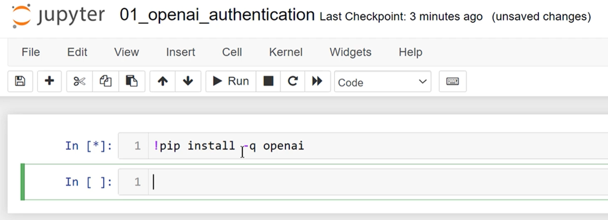


You'll need to auth with the API key and should store it as an env var

In jupyter notebook to create environment variables to store API key

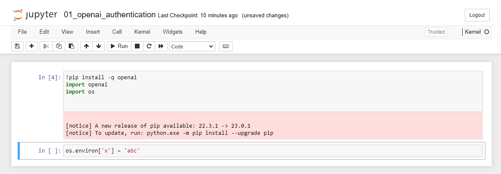

to retrieve the value:

```
os.getenv('x')
```


```
os.environ['OPENAI_API_KEY'] = 'key_in_clear_text'
openai.api_key = os.getenv('OPENAI_API_KEY')
```

instead of pasting it in clear text, you can prompt for it as input

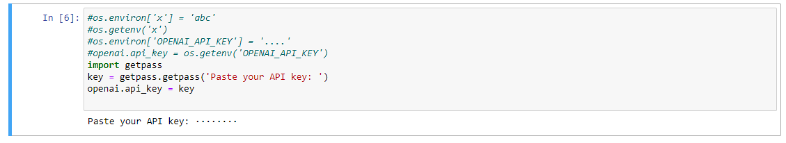


# 2-7: Open AI Models

Ok we now have an OpenAI account and an OpenAI API key

let's strart making requests to the open API models

but lets first talk about them

An AI model is a software program that uses specific ML and DL algorithms and has been trained on a set of data to perform specific tasks

ML  - machine learning

DL - deep learning

Models https://platform.openai.com/docs/models


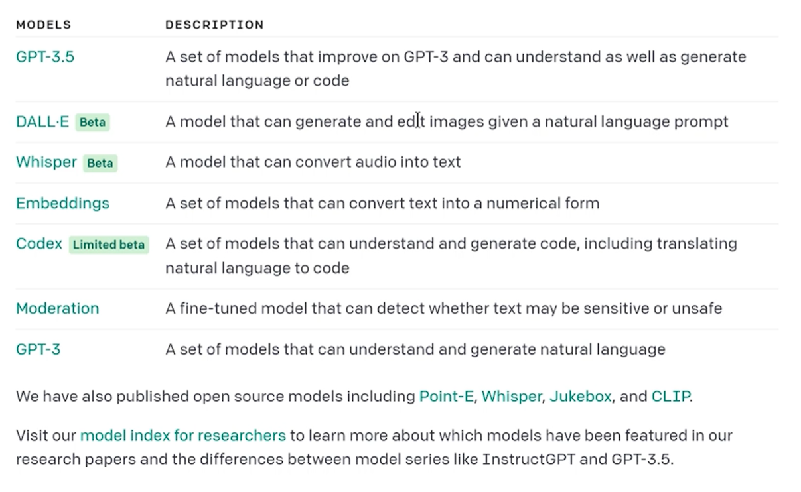

Pricing:

openai.com/pricing

You can use the playground to compare models

https://platform.openai.com/playground


# 2-8: Making GPT-3 Requests Using the OpenAI API

now you'll learn how to make your applciation talk to openAPI models

create the prompt

prompt engineering

forums / discords / cheat sheets

deeper into this in another video

we're going to use davinci

the prompt is the most important part

Example:

```
openai.Completion.create()              # will take some paramaters and return a response object
response = openai.Compeltion.create(
    model='text-davinci-003',
    prompt=prompt,
    temperature=0.9,
    max_tokens=150,
    top_p=1,
    frequency_penalty=0,
)
```

choose your models, these can change. 

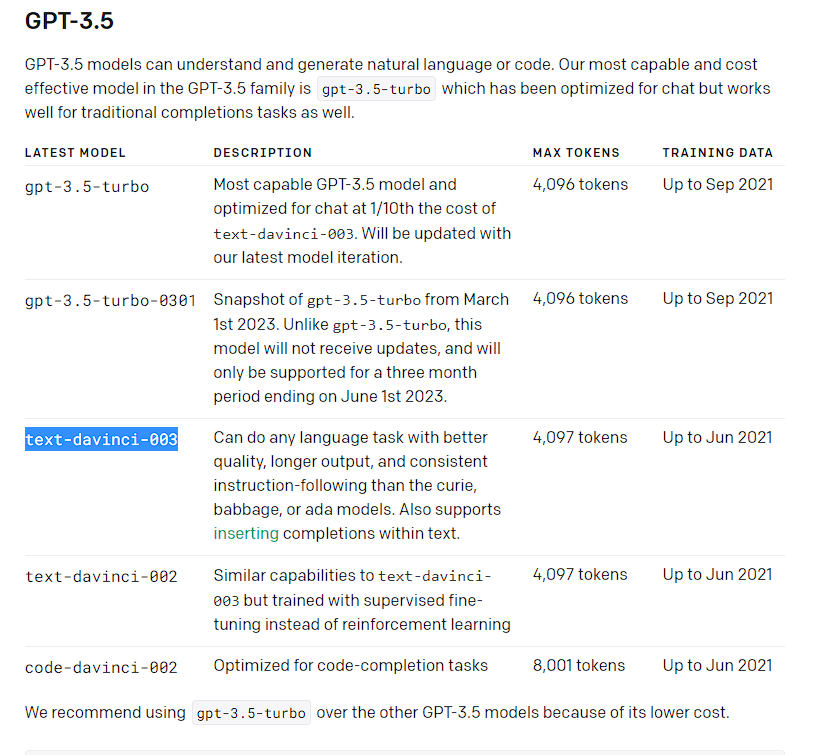

result:

```
import openai
import os
import getpass

key = getpass.getpass(prompt='Enter your OpenAI API key: ')
openai.api_key = key

# prompt user to enter their text
prompt = input('Enter your text: ')
print('prompt is: ', repr(prompt))

#openai.Completion.create()              # will take some paramaters and return a response object
response = openai.Completion.create(
    model='text-davinci-003',
    prompt=prompt,
    temperature=0.8,    # controls the randomness of the output, the higher the temp the more random. 0-2  default is 1.  0 is deterministic
    max_tokens=1000     # max generated for completion, 4096 is the max, input and output count to this limit
)

#print(response)
print(response['choices'][0]['text'])
```

# 02-09-Making ChatGPT requests using the openAI API

We talked about GPT 3 and DaVinci

instead of sending a single string in the previous message

we can send a list of messages as input

we'll send them as a list of dictionaries

```
prompt = 'tell me the name of the largest city in the world'

messages = [
    {},
    {},
    {}
]

```

There are roles => system, user, assistant

conversations can be 1 message or many pages

typically conversation is formatted with the system message

system message sets behavior of system

the user message is what you ask the assistant

we're using conversations this time

```
prompt = 'tell me the name of the largest city in the world'

# roles => system, user, assistant
messages = [
    {'role': 'system', 'content':'Answer as concisely as possible.'},
    {'role': 'user', 'content':prompt},
]
response = openai.ChatCompletion.create(
    model = 'gpt-3.5-turbo',
    messages = messages,
    temperature = 0.8,
    max_tokens = 1000
)

```

the result is:

```
import openai
import getpass

key = getpass.getpass(prompt='Enter your OpenAI API key: ')
openai.api_key = key

prompt = 'tell me the name of the largest city in the world'

# roles => system, user, assistant
messages = [
    {'role': 'system', 'content':'Answer as concisely as possible.'},
    {'role': 'user', 'content':prompt},
]
response = openai.ChatCompletion.create(
    model = 'gpt-3.5-turbo',
    messages = messages,
    temperature = 0.8,
    max_tokens = 1000
)

print(response)
```

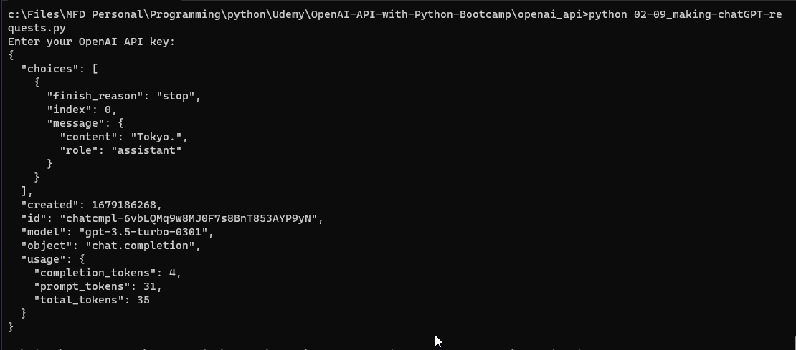

the assistant answered with 'content' that is Tokyo

to print the answer:

```
print(response['choices'][0]['message']['content'])
```

you can also use

```
print(response['choices'][0].message.content)
```

let's talk about the system role in the messages structure

the system message sets the behavior of the assistant

in this example the assistant was instructed to answer as concisely as possible. 

let's see what happens if we ask it to answer as detailed as possible. 

```
# roles => system, user, assistant
messages = [
    {'role': 'system', 'content':'Answer as detailed as possible.'},
    {'role': 'user', 'content':prompt},
)
```

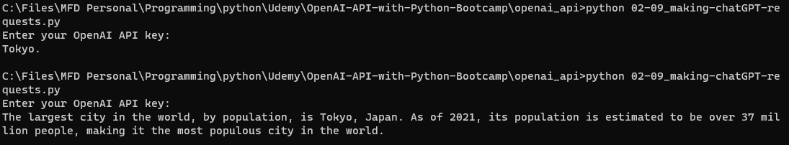

that system prompt can be widely variable:

```
messages = [
    {'role': 'system', 'content':'Answer as detailed as possible, also while rhyming as much as possible.'},
```

or

```
messages = [
    {'role': 'system', 'content':'Answer as detailed as possible, answer as Yoda from Star Wars'},
```

these can change frequently , stay up to date by visiting https://platform.openai.com/docs/guides/chat/introduction

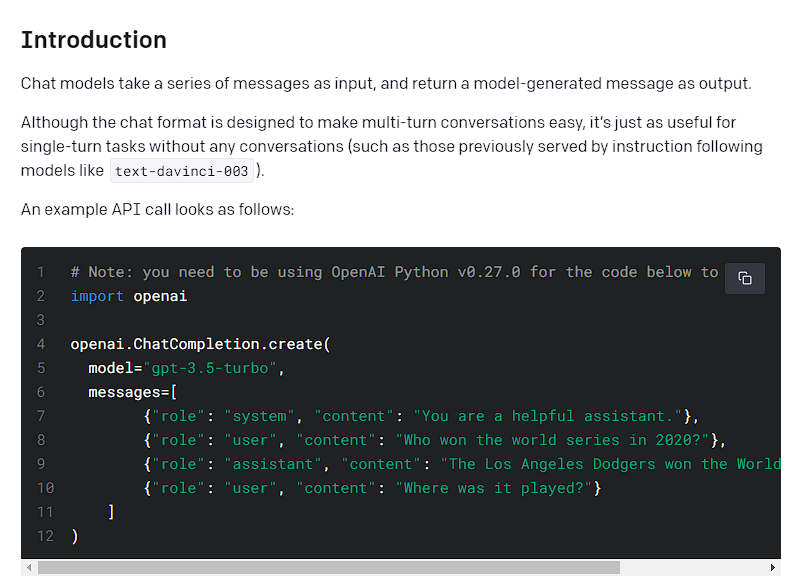

# 2-10) Diving into ChatGPT

so far we've used the API to get responses

let's dive deeper into ChatGPT

the models focus on 

- large language models (LLM)
- Self-attention mechanisms
- Reinforcement Learning from Human Feedback (RLHF)

GPT = "Generative pre-trained transformer"

it's a deep learning model that adopts the mechanism of self-attention, to differentiate the sig of each part of the input data using weights

LLMs increase their capability as the size of their input and parameter space increase

Issues with LLM:

- capability
- alignment

Capability refers to models ability to perform a specific task or how well it is able to opimize it's objective function

Alignment is concerned wiht what we want the model to do vs what is has been trained to do. 

LLMs such as the GPT-3 models are misaligned because they are trained on mass amounts of data from the internet, may not always produce correct output. 

it's a probability function of word sequences

Alignment issues in LLMs manifest as:

- model hallucinations
- lack of interpretability (how did the model get to that?)
- biased or toxic output

GPT-3 famile are generative models

Core techniques are 

- next token prediction
- masked language modeling

Next token prediction means the model is given a sequence of words as input and is asked to predict in a reasonable human like way the next word

Masked Language modeling, words in input are replaced with special tokens, such as [MASK] the model should predict the correct word that should be inserted in the place of the [MASK]

for example:

```
The area of a circle is [MASK] times the radius squared
```

the model should say pi

but

```
The roman Empire [mask] with the reign of Agustus
```

could choose 'begin' OR 'ended' because both are likely

to try to overcome this, it uses re-enforcement learning to try to overcome this

# 2 -11 Open API Costs

Pricing

free API credits for the first 3 months

cost has been decreasing dramatically

you pay only for what you use and can check  your usage at any time

also manage spending with usage limits

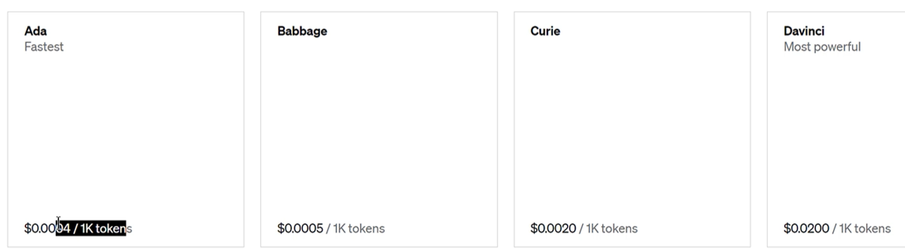

A token is a chunk of characters.  AI models process by breaking down into tokens

100 tokens = 75 words

Tokens...

interaction limited to a max # of tokens, GhatGPT is 4096

- tokens are pieces of words. Input is broken down into words. 
- can be words or chunks of characters

the open ai python library tiktoken will allow you to check

or the tokenizer:

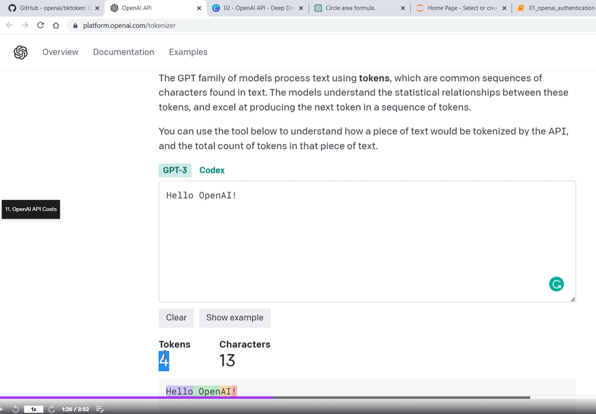

tokens are strange

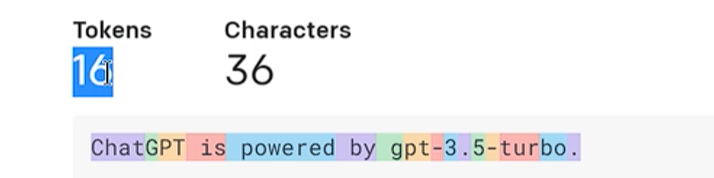

## To check the exact number of tokens used by an api call:

To check the exact number of tokens consumed, check the `usage` field in the API response

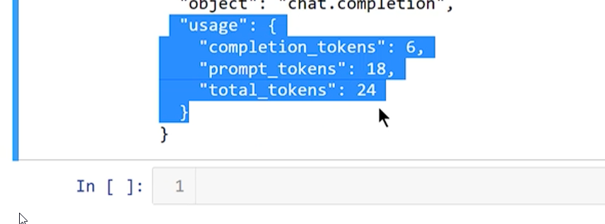

