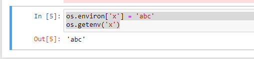

# Deep Dive into Open AI, ChatGPT, GPT-3, DALL-E, Whisper

## 2-1: Create an OpenAI Account and an OpenAI API key


To use the AI models by OpenAI, create an account and create an OpenAI API key

Login https://platform.openai.com/


## 2-2: Installing OpenAI API library and Authenticating

two native and officially supported API for python


```
import openai
```

 To run a command in jupyter notebook prefix it with `!`


You'll need to auth with the API key and should store it as an env var

In jupyter notebook to create environment variables to store API key


to retrieve the value:

```
os.getenv('x')
```



```
os.environ['OPENAI_API_KEY'] = 'key_in_clear_text'
openai.api_key = os.getenv('OPENAI_API_KEY')
```

instead of pasting it in clear text, you can prompt for it as input


# 2-7: Open AI Models

Ok we now have an OpenAI account and an OpenAI API key

let's strart making requests to the open API models

but lets first talk about them

An AI model is a software program that uses specific ML and DL algorithms and has been trained on a set of data to perform specific tasks

ML  - machine learning

DL - deep learning

Models https://platform.openai.com/docs/models


Pricing:

openai.com/pricing

You can use the playground to compare models

https://platform.openai.com/playground


# 2-8: Making GPT-3 Requests Using the OpenAI API

now you'll learn how to make your applciation talk to openAPI models

create the prompt

prompt engineering

forums / discords / cheat sheets

deeper into this in another video

we're going to use davinci

the prompt is the most important part

Example:

```
openai.Completion.create()              # will take some paramaters and return a response object
response = openai.Compeltion.create(
    model='text-davinci-003',
    prompt=prompt,
    temperature=0.9,
    max_tokens=150,
    top_p=1,
    frequency_penalty=0,
)
```

choose your models, these can change. 


result:

```
import openai
import os
import getpass

key = getpass.getpass(prompt='Enter your OpenAI API key: ')
openai.api_key = key

# prompt user to enter their text
prompt = input('Enter your text: ')
print('prompt is: ', repr(prompt))

#openai.Completion.create()              # will take some paramaters and return a response object
response = openai.Completion.create(
    model='text-davinci-003',
    prompt=prompt,
    temperature=0.8,    # controls the randomness of the output, the higher the temp the more random. 0-2  default is 1.  0 is deterministic
    max_tokens=1000     # max generated for completion, 4096 is the max, input and output count to this limit
)

#print(response)
print(response['choices'][0]['text'])
```

# 02-09-Making ChatGPT requests using the openAI API

We talked about GPT 3 and DaVinci

instead of sending a single string in the previous message

we can send a list of messages as input

we'll send them as a list of dictionaries

```
prompt = 'tell me the name of the largest city in the world'

messages = [
    {},
    {},
    {}
]

```

There are roles => system, user, assistant

conversations can be 1 message or many pages

typically conversation is formatted with the system message

system message sets behavior of system

the user message is what you ask the assistant

we're using conversations this time

```
prompt = 'tell me the name of the largest city in the world'

# roles => system, user, assistant
messages = [
    {'role': 'system', 'content':'Answer as concisely as possible.'},
    {'role': 'user', 'content':prompt},
]
response = openai.ChatCompletion.create(
    model = 'gpt-3.5-turbo',
    messages = messages,
    temperature = 0.8,
    max_tokens = 1000
)

```

the result is:

```
import openai
import getpass

key = getpass.getpass(prompt='Enter your OpenAI API key: ')
openai.api_key = key

prompt = 'tell me the name of the largest city in the world'

# roles => system, user, assistant
messages = [
    {'role': 'system', 'content':'Answer as concisely as possible.'},
    {'role': 'user', 'content':prompt},
]
response = openai.ChatCompletion.create(
    model = 'gpt-3.5-turbo',
    messages = messages,
    temperature = 0.8,
    max_tokens = 1000
)

print(response)
```


the assistant answered with 'content' that is Tokyo

to print the answer:

```
print(response['choices'][0]['message']['content'])
```

you can also use

```
print(response['choices'][0].message.content)
```

let's talk about the system role in the messages structure

the system message sets the behavior of the assistant

in this example the assistant was instructed to answer as concisely as possible. 

let's see what happens if we ask it to answer as detailed as possible. 

```
# roles => system, user, assistant
messages = [
    {'role': 'system', 'content':'Answer as detailed as possible.'},
    {'role': 'user', 'content':prompt},
)
```


that system prompt can be widely variable:

```
messages = [
    {'role': 'system', 'content':'Answer as detailed as possible, also while rhyming as much as possible.'},
```

or

```
messages = [
    {'role': 'system', 'content':'Answer as detailed as possible, answer as Yoda from Star Wars'},
```

these can change frequently , stay up to date by visiting https://platform.openai.com/docs/guides/chat/introduction


