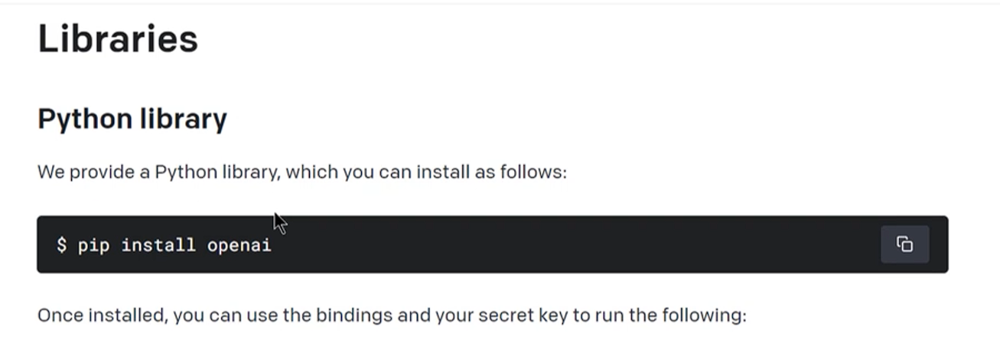

# Deep Dive into Open AI, ChatGPT, GPT-3, DALL-E, Whisper

## 2-1: Create an OpenAI Account and an OpenAI API key

To use the AI models by OpenAI, create an account and create an OpenAI API key

Login https://platform.openai.com/

## 2-2: Installing OpenAI API library and Authenticating

